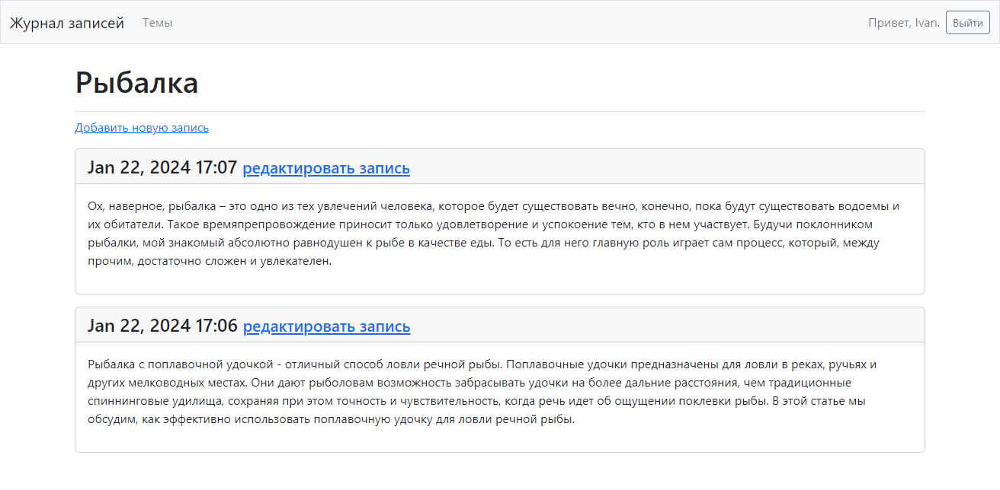

<h1>Журнал для записей :blue_book: :pencil2:</h1>

_pet-project_

Приложение "__Журнал для записей__" позволяет регистрироваться, создавать новые темы. Вы можете создавать множество записей/заметок в каждой теме. Приложение можно использовать как журнал своего обучения.

Последняя созданная вами тема всегда буддет первая в списке тем. Последняя созданная в теме запись также будет отображаться  первой и иметь дату и время создания, или ее редактирования.

Скриншот страницы с записями

стек:
* Python
* Django
* HTML
* Bootstrap

